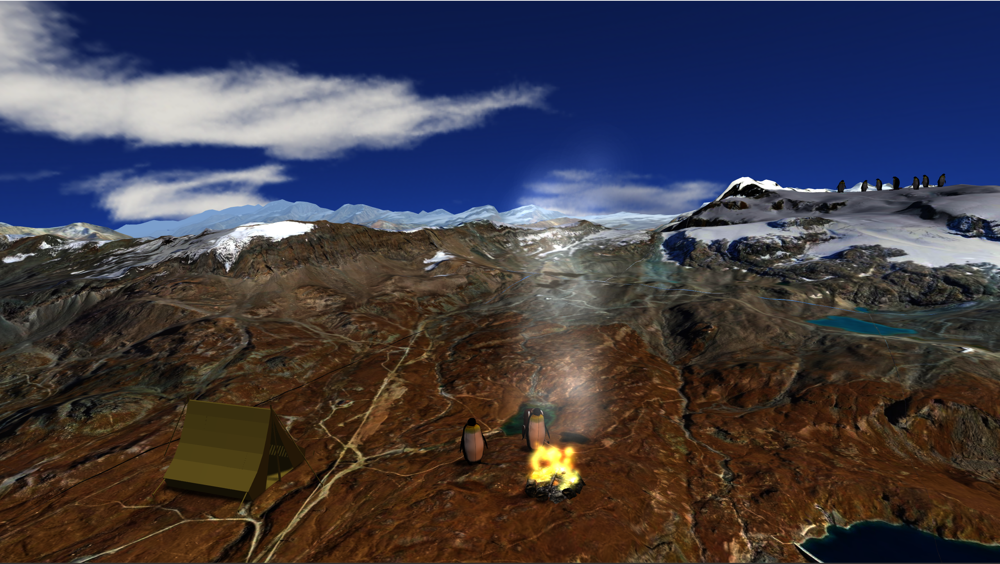

# ⛰️ Matterhorn 3D Scene — OpenGL & C++

An interactive 3D scene built with OpenGL featuring the Matterhorn mountain, dynamic lighting, particle-based fire, animated penguins, and a full camera animation system.

---

## Features

- **3D Scene** — Detailed Matterhorn model with segmented parts, textured objects (tent, skis, snowboard, backpack, goggles, astronaut, fireplace)
- **Day / Night Cycle** — Toggle between day and night with different sky domes, fog colors, and light intensities (`M` / `N`)
- **Dynamic Lighting** — Directional sun light + point light from the fire, with adjustable sun position via arrow keys
- **Shadow Mapping** — High-resolution (8192×8192) directional shadow map with toggleable shadows (`O`)
- **Particle System** — Instanced fire and smoke particles with additive blending, color transitions, and physics simulation
- **Animated Penguins** — Wing-flapping animation using pivot-based rotation; collision detection between camera and penguins
- **Camera Animation** — Catmull-Rom spline keyframe system, record positions with `P`, play/stop with `K`
- **Fog** — Distance-based linear fog that adapts to day/night mode
- **Render Modes** — Solid (`1`), Wireframe (`2`), Point (`3`)

---

## Controls

| Key | Action |
|-----|--------|
| `W A S D` | Move camera |
| `Mouse` | Look around |
| `Shift` | Speed boost |
| `M` / `N` | Day / Night |
| `O` | Toggle shadows |
| `Arrow Keys` | Move sun direction |
| `1` / `2` / `3` | Solid / Wireframe / Point mode |
| `P` | Print camera keyframe to console |
| `K` | Play / Stop camera animation |
| `ESC` | Exit |

---

## Built With

- C++ / Visual Studio
- OpenGL (GLEW, GLFW)
- GLM — math library
- Custom GLSL shaders (depth map, light, fire instanced)

---

## Shaders

| Shader | Purpose |
|--------|---------|
| `shaderStart` | Sky dome rendering |
| `lightShader` | Phong lighting + shadow mapping + fog |
| `fire_instanced` | Instanced particle rendering (fire & smoke) |
| `depthMap` | Shadow map generation |

---

## Project Structure

\`\`\`
├── models/          # 3D models (.obj) and textures
├── shaders/         # GLSL vertex and fragment shaders
├── OpenCVApplication.cpp  # Main application
├── common.cpp / .h  # Utilities
└── OpenCVApplication.sln  # Visual Studio solution
\`\`\`

## Preview

